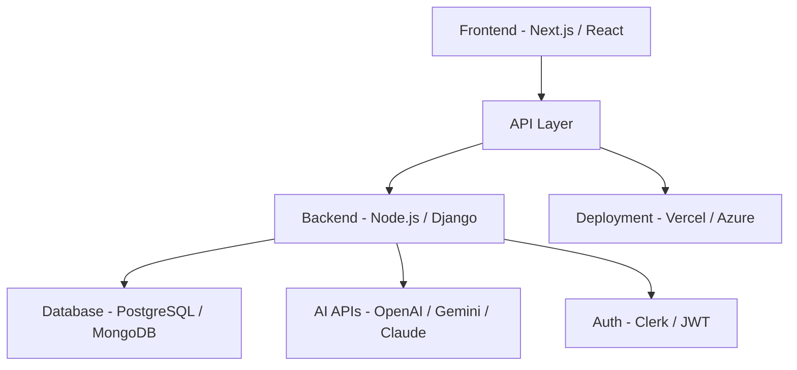

<!-- ==================== HERO ==================== -->

<h1 align="center">Hi 👋, I'm Md Dawood Rahman</h1>

<p align="center">
  
</p>

<p align="center">
  
</p>

<p align="center">
  <a href="https://linkedin.com/in/mddawoodrahman"></a>
  <a href="https://x.com/mddawoodrahman"></a>
  <a href="https://instagram.com/dawoodvibe"></a>
</p>

---

## 🧠 Developer Profile

```yaml
Name: Md Dawood Rahman
Role: Software Engineer (MCA Candidate)
Focus: Full-Stack + AI Applications + Cloud
Architecture Mindset:
  - Scalable systems
  - Clean UI/UX
  - API-first design
  - Performance optimized
```

---

## 🚀 Featured Projects (Product Style)

### 🧩 Medusa — Cloud Storage Platform

```diff
+ Secure file storage + sharing
+ Real-time file management
+ Analytics dashboard
+ Public shareable links
```

### 🏋️ Wixon Gym — AI Fitness SaaS

```diff
+ AI workout & nutrition assistant
+ Subscription + payment system
+ Role-based dashboard
+ Real-time booking system
```

### ⚡ Zeus — AI Chrome Extension

```diff
+ Prompt auto-enhancement
+ Multi-model AI support
+ One-click rewrite system
+ Works across ChatGPT, Gemini, Claude
```

---

## 🏗️ Architecture Thinking



---

## ⚙️ Tech Stack

### 💻 Core


### 🧱 Frameworks


### 🗄️ Databases


### ☁️ DevOps


### 🤖 AI Stack


---

## 📊 GitHub Analytics

<p align="center">
  
  
</p>

<p align="center">
  
</p>

---

## 🧩 Current Focus

* 🚀 Building AI SaaS products
* ⚡ Scaling full-stack architectures
* 🧠 Exploring advanced AI integrations

---

## 💡 Philosophy

> "Build scalable products, not just projects."

---

## ☕ Support

<p align="center">
  <a href="https://buymeacoffee.com/mddawoodrahman">
    
  </a>
</p>

---

<p align="center">⭐ If you like my work, consider giving a star</p>
